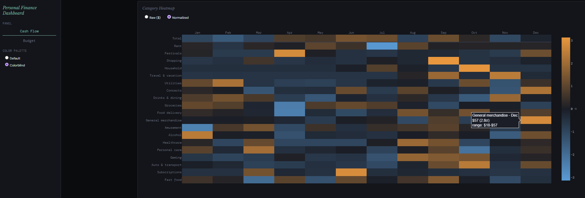

# Personal Finance Dashboard

A personal analytics dashboard built in Python Dash, applying credit risk and
mortgage analytics techniques to personal spending data. Built as a hands-on
learning project and portfolio piece connecting mortgage/consumer
credit analytics experience to personal finance.



---

## Why This Project

Credit risk analytics and personal finance analytics ask structurally similar
questions: How does behavior vary over time? What's seasonal versus what's a
real trend? How persistent is a given state once you're in it? This project
takes three techniques from mortgage/consumer credit work and applies them to
transaction-level personal spending data, sourced from
[Origin Financial](https://useorigin.com):

1. **STL seasonal decomposition** — the same technique used to separate
   delinquency rate trends from seasonal noise in loan performance data,
   applied here to monthly spending. Splits spending into trend, seasonal,
   and residual components, so a rent increase (trend) is distinguishable
   from December travel spending (seasonal) or a one-off moving cost
   (residual).

2. **Roll-rate transition matrices** — a core credit risk tool for measuring
   how loans move between delinquency buckets month over month (30 days past due to current,
   30dpd to 60dpd, etc.). Applied here to personal budget categories: given a
   category was over budget this month, what's the probability it's over
   budget again next month? This surfaces which spending categories have
   "sticky" self-reinforcing overspending versus which self-correct quickly.

3. **Scenario-based reserve/runway analysis** — similar in spirit to how
   underwriters assess borrower reserves under stress scenarios. This
   dashboard computes discretionary spending runway under three scenarios
   (current pace, moderate belt-tightening, bare-minimum floor) given a
   manually entered cash balance.

---

## Panels

### Panel A — Cash Flow
- **Waterfall chart**: income -> needs -> wants -> net, for a selectable
  trailing window
- **STL seasonality decomposition**: trend / seasonal / residual components
  of monthly spending, with `robust=True` to down-weight one-off outliers
  (e.g. security deposit or moving costs) rather than let them distort
  the seasonal pattern
- **Category heatmap**: spending by category x month-of-year, with a
  raw-dollar/row-normalized (z-score) toggle so categories with very
  different spending scales (rent vs. snacks) remain visually comparable
- **This month vs. 3-month average**: prorated current-month spending by
  category, ranked by deviation from the trailing 3-month average
- **Spending volatility**: coefficient of variation (std/mean) by category,
  identifying which categories are erratic vs. stable

### Panel B — Budget & Risk
- **Roll-rate transition matrix**: over/under-budget state transitions,
  pooled across categories
- **Per-category over-budget persistence**: which specific categories are
  prone to persistent overspending vs. quick recovery
- **Discretionary runway calculator**: given a manually entered cash
  balance, computes months of runway under three spending scenarios

---

## Data

Transaction data is sourced from [Origin Financial](https://useorigin.com)
as CSV exports. Two other sources (Mint, Empower/PersonalCapital) were
evaluated but not integrated in this version — see "Known Limitations"
below.

Data files are **not committed to this repository** (see `.gitignore`) since
they contain personal financial information. To run this dashboard with your
own data, place an Origin transaction CSV export in a local `data/` folder;
the loader (`data.py`) automatically finds and reads the most recent file
present.

## Known Limitations & Design Choices

Documenting these deliberately, since a lot of the actual analytical
thinking in this project happened in navigating these tradeoffs, not just
in writing the chart code:

- **No net worth panel.** Origin doesn't export account balance snapshots,
  only transaction-level data, so a true net worth trend (assets vs.
  liabilities over time) wasn't buildable from available data. Panel B
  (Budget & Risk) was substituted instead, using only transaction-level
  data.
- **Small sample sizes** in the per-category persistence chart (Panel B) —
  most categories have only 3–6 "over budget" observations within the
  12-month window. Bar opacity is scaled by observation count to visually
  flag low-confidence estimates rather than hiding them outright.
- **Runway calculator uses three scenarios, not a single "discretionary
  runway" number.** An earlier version computed cash ÷ average Wants
  spending alone, which doesn't correspond to a realistic scenario (Needs
  still have to be paid regardless of Wants spending). The current version
  shows Total Runway (current pace), Reduced Runway (Needs + 25% of average
  Wants, a realistic belt-tightening estimate), and a Needs-Only theoretical
  floor.
- **Historical data (Mint, 2017–2024; PersonalCapital/Empower, 2018–2025)
  not yet integrated.** Schema differences between the three sources
  (differing `Type`/`Category` conventions, account-name formatting) made
  reconciliation nontrivial; the current version uses Origin data only
  (Nov 2023–present).

## Tech Stack

- **Dash 4.x** / **Plotly 6.x** for the interactive dashboard and charts
- **pandas 3.x** for data aggregation and transformation
- **statsmodels** for STL decomposition
- **uv** for environment/dependency management
- Color palette centralized in `theme.py`, including a colorblind-accessible
  (blue/orange) alternative palette toggle, given the developer's own
  red-green color vision deficiency

## Running Locally

```bash
git clone https://github.com/sebastianbautista/personal-finance-dash.git
cd personal-finance-dash
uv sync
# place an Origin transaction CSV export in data/
uv run app.py
```

Then open `http://127.0.0.1:8050`.

## Project Structure

```
personal-finance-dash/
  app.py              # entry point, CSS, tab routing, palette toggle
  data.py              # Origin CSV loader and enrichment
  theme.py              # centralized color palette + Plotly theme
  panels/
    cashflow.py          # Panel A: cash flow charts and KPIs
    budget.py             # Panel B: budget/risk charts and runway calculator
  docs/
    screenshot.png          # dashboard screenshot (add your own)
  data/                     # gitignored — place your own Origin CSV export here
```
